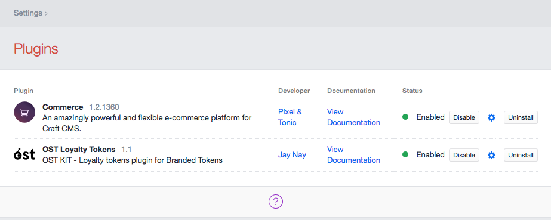
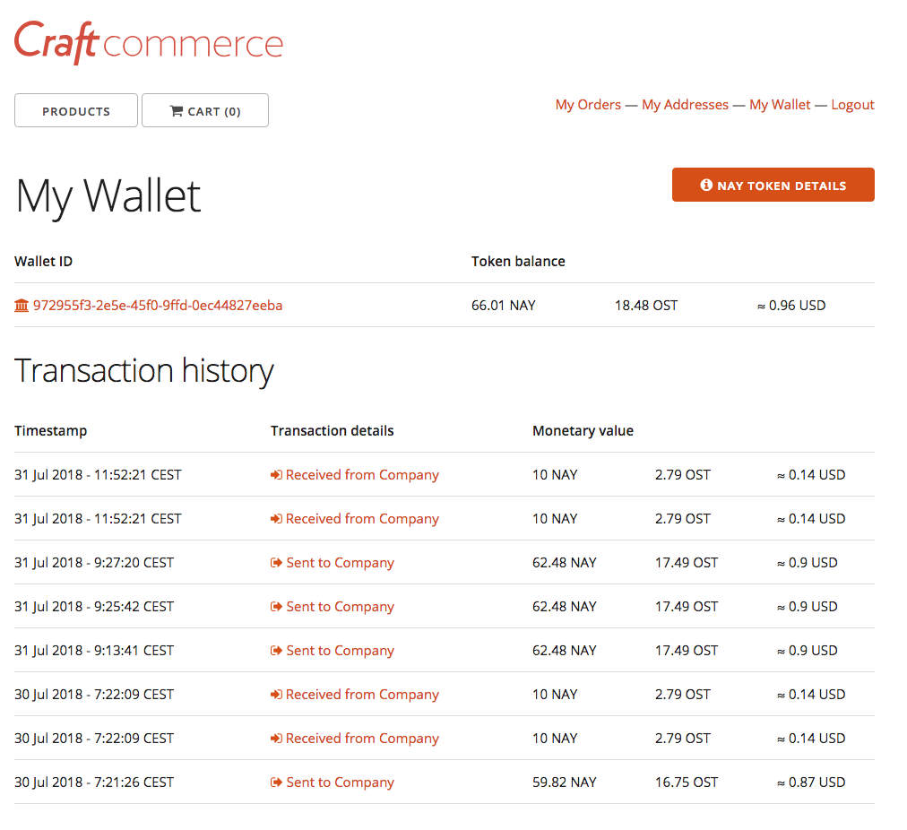

# OST Loyalty Tokens plugin for Craft Commerce

OST KIT - Loyalty plugin for Branded Tokens

 

## Installation

To install OST Loyalty Tokens, follow these steps:

1. Download & unzip the file and place the `ostloyaltytokens` directory into your `craft/plugins` directory
2.  -OR- do a `git clone https://github.com/realJayNay/ost-kit-loyalty-tokens.git` directly into your `craft/plugins` folder.  You can then update it with `git pull`
3.  -OR- install with Composer via `composer require realJayNay/ost-kit-loyalty-tokens`
4. Install plugin in the Craft Control Panel under Settings > Plugins
5. The plugin folder should be named `ostloyaltytokens` for Craft to see it.  GitHub recently started appending `-master` (the branch name) to the name of the folder for zip file downloads.

OST Loyalty Tokens works on Craft 2.4.x and Craft 2.5.x. 
This version is compatible with the [OST KIT REST API v1.1](https://dev.ost.com).

## OST Loyalty Tokens Overview

[OST KIT](https://kit.ost.com) gives you all the tools you need to run your blockchain-powered economy on scalable OpenST utility blockchains. OST KIT is at the time of writing under active development. The phase 2 of the closed alpha version is currently being tested in a private [Developer Proofs of Concept challenge](https://medium.com/ostdotcom/kicking-off-ost-kit-phase-ii-developer-proofs-of-concept-challenge-5f2987f92a97). This plugin is one of the participating projects.

The **Loyalty Tokens** plugin builds on this toolkit to provide a blockchain-based loyalty card solution that allows any [Craft Commerce](https://craftcommerce.com) web shop to easily add a reward system based on Branded Tokens for completed orders.

When the plugin is enabled, three event listeners are created:
 1. an event listener on the [users.onSaveUser](https://docs.craftcms.com/v2/plugins/events-reference.html#users-onSaveUser) event 
 to [create an OST KIT user](https://dev.ost.com/docs/api_users_create.html) with the same username whenever a user registers. 
 The resulting OST KIT ID is stored in an additional user field `OST KIT UUID` that must be setup first. 
 This will be the receiver of the loyalty tokens.
 2. an event listener on the [commerce_orders.onOrderComplete](https://craftcommerce.com/docs/events-reference#commerce_orders.onordercomplete) event to [execute a specific OST KIT 'company_to_user' transaction type](https://dev.ost.com/docs/api_transaction-types_execute.html) when a customer successfully completes on order. A reference to the OST KIT transactions is stored in an additional order field `OST KIT Transaction UUD` that must be setup first. 
 3. an event listener on the [commerce_payments.onRefundTransaction]() event to return tokens back to the company in case a transaction is refunded. 
 
The plugin provides a _Token balance_ [Twig](https://twig.symfony.com/doc/2.x/templates.html) template and variable that can be easily integrated to provide an overview of all related blockchain transactions with click-through links to the order details and the transaction details on the blockchain explorer [OST View](https://view.ost.com/).

The plugin interacts with OST KIT via a PHP client. If you want to use this client in your own projects, you can find it here: [ost-kit-php-client](https://github.com/realJayNay/ost-kit-php-client). 

## Configuring OST Loyalty Tokens

- Once the plugin directory is copied to the `plugins` folder of Craft CMS, it must first be installed by pressing the corresponding button.

- All configuration data that is needed by the plugin to perform its tasks is securely stored in the plugin settings of Craft CMS. A settings page is included and is accessible in the admin console as soon as the plugin is installed. To access the plugin settings page, press the _cog_  icon in the plugins admin area of Craft CMS.

- Setup a custom user field `OST KIT UUID` and a custom order field `OST KIT Transaction UUID`. This is a [Craft CMS feature](https://craftcms.com/features/custom-fields), please see the related documentation for more information on how to setup custom fields and assign the to a model.

- Setup links to the balance overview template that is provided by the plugin to allow the user to see its Branded Token balance from within your web shop frontend site. The screenshot below is an example of how the template looks like in the Craft Commerce sample frontend template. 

## Using OST Loyalty Tokens

The plugin interacts with OST KIT automatically whenever a user is registered, an order is completed or a payment is refunded.

## OST Loyalty Tokens Roadmap

Some things to do, and ideas for potential features:

* Upgrade to [OST KIT REST API v1.0](https://dev.ost.com/docs/api.html).
* Replace the refund event listener with a smart contract that acts as an escrow account and finalizes when the order is delivered.

## Questions, feature requests and bug reports
If you have questions, have a great idea for the plugin or ran into issues using this plugin: please report them in the project's [Issues](https://github.com/realJayNay/ost-kit-loyalty-tokens/issues) area.  

Brought to you by [Jay Nay](https://github.com/realJayNay)
